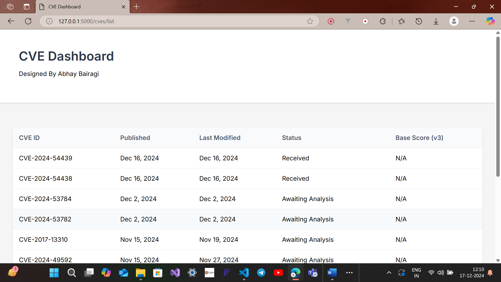
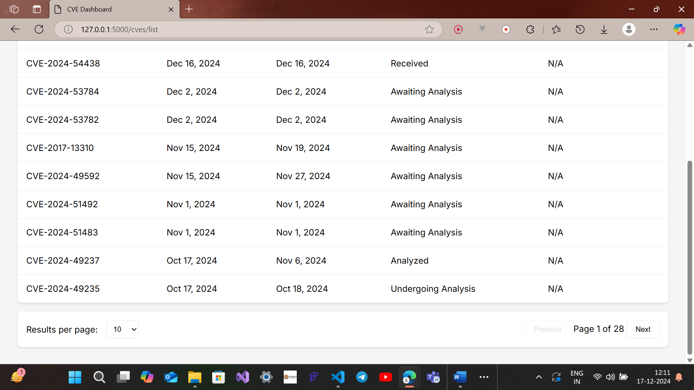
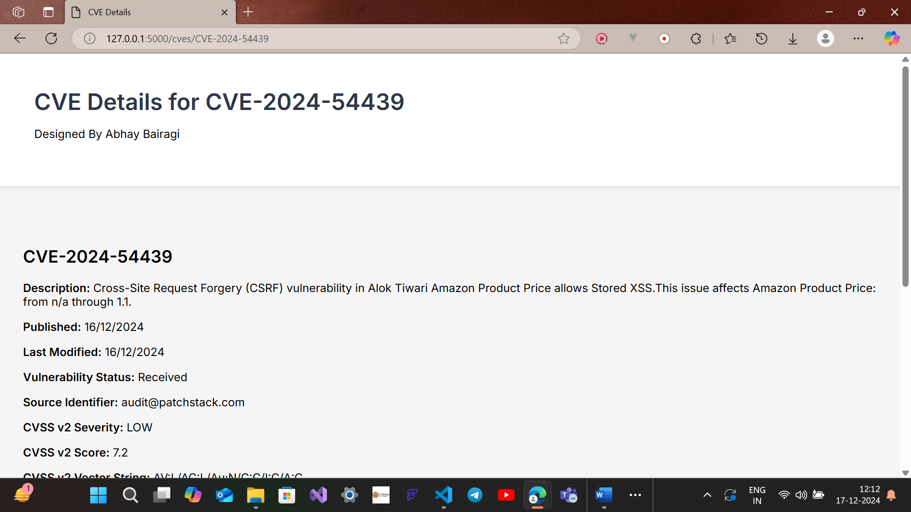
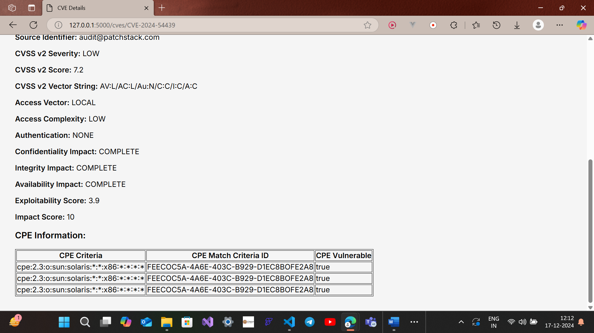
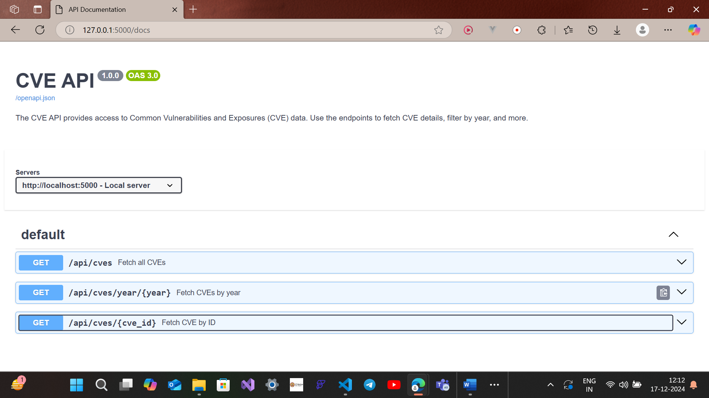
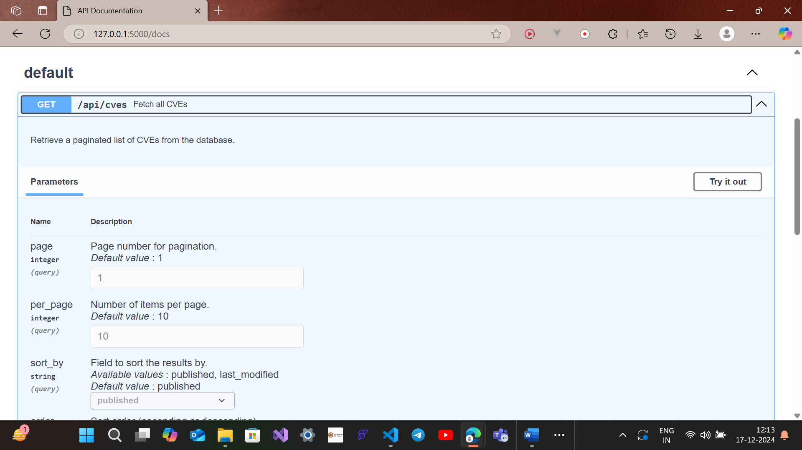
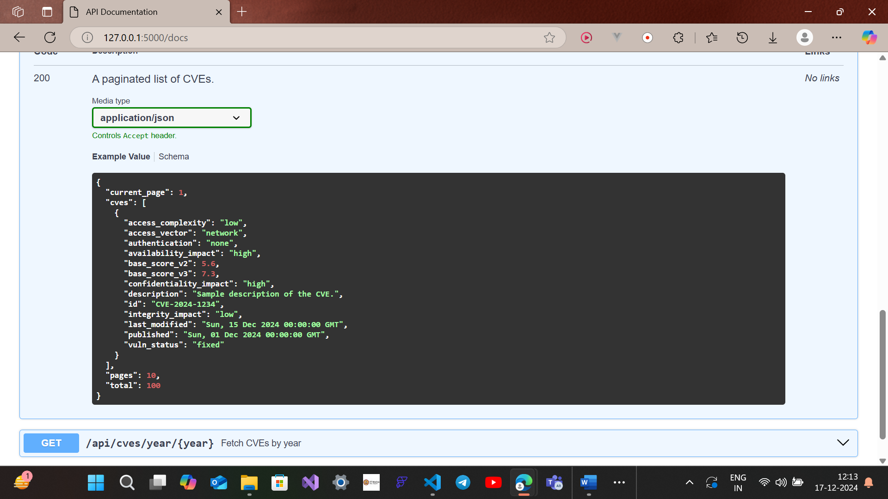
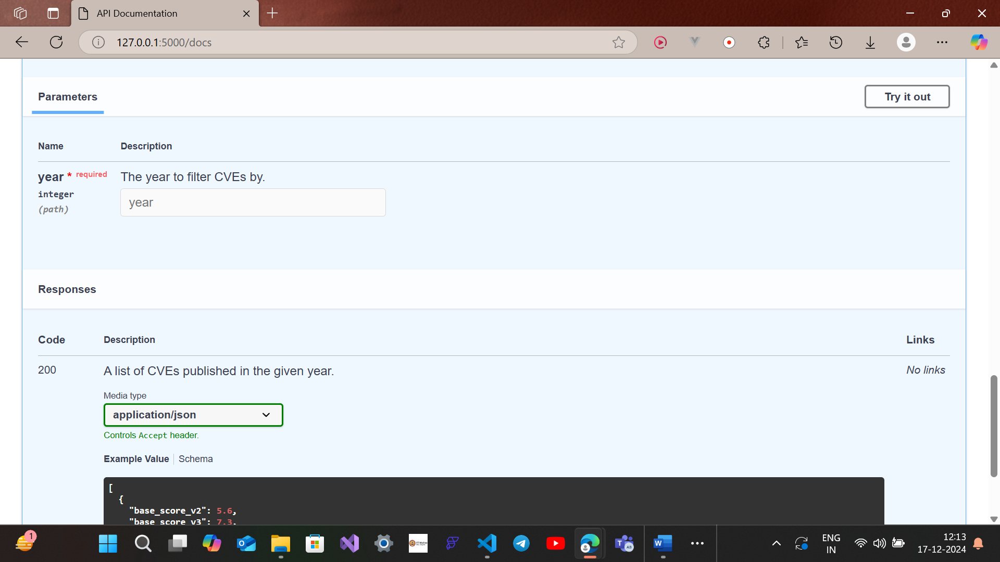
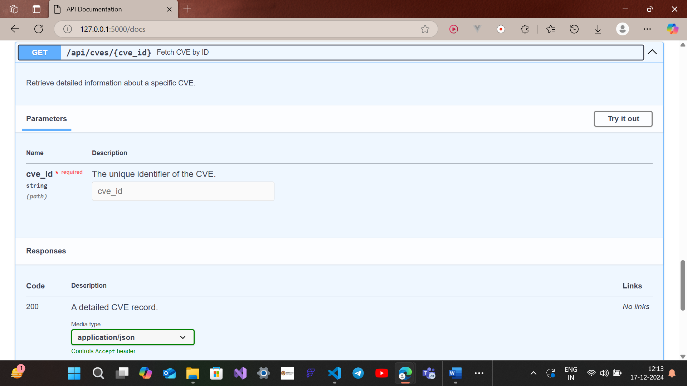

# CVE Dashboard

A comprehensive Flask-based web application for managing and visualizing Common Vulnerabilities and Exposures (CVE) data from the National Vulnerability Database (NVD).

## Features

- 🔄 Automated CVE data synchronization from NVD API
- 📊 Interactive data visualization with sorting and filtering
- 🔍 Advanced search and filtering capabilities
- 📱 Responsive design for all devices
- 📄 Comprehensive API documentation
- ⚡ Real-time updates
- 🔒 Data validation and sanitization
## Screenshots
- CVE List Table  (/cves/list)



- CVE Details (/cves/CVE-2024-54439)



- API Docs (/docs)





## Problem Statement

The project aims to create a system that:
1. Consumes CVE information from the NVD API
2. Stores data in a structured database
3. Implements periodic synchronization
4. Provides filtering and search capabilities
5. Visualizes data through a user-friendly interface

## Solution Approach

### 1. Architecture Design
- **Modular Structure**: Breaking down the application into smaller, focused components
- **Clean Architecture**: Separation of concerns between data, business logic, and presentation
- **RESTful API Design**: Following REST principles for API endpoints

### 2. Implementation Strategy
- Iterative development approach
- Test-driven development (TDD)
- Continuous integration and deployment
- Regular code reviews and refactoring

### 3. Data Management
- Efficient data synchronization with NVD API
- Data validation and sanitization
- Deduplication strategies
- Optimized database queries

## Project Structure

```
 project
│       ├── api.yaml
│       ├── app.py
│       ├── cveapi.py
│       ├── instance
│       │   └── cve.db
│       ├── static
│       │   └── css
│       │       └── style.css
│       ├── templates
│       │   ├── details.html
│       │   └── index.html
│       └── test.py         # Documentation
```

## Coding Best Practices

### 1. Code Organization
- **Single Responsibility**: Each module handles one specific functionality
- **Modularity**: Code is organized into small, focused files
- **Separation of Concerns**: Clear separation between different layers of the application
- **DRY (Don't Repeat Yourself)**: Common functionality is extracted into utility modules

### 2. Code Quality
- **Consistent Style**: Following PEP 8 for Python and ESLint for JavaScript
- **Type Hints**: Using Python type annotations for better code clarity
- **Documentation**: Comprehensive docstrings and comments
- **Error Handling**: Proper exception handling and logging

### 3. Testing
- **Unit Tests**: Testing individual components in isolation
- **Integration Tests**: Testing component interactions
- **End-to-End Tests**: Testing complete user workflows
- **Test Coverage**: Maintaining high test coverage

### 4. Performance Optimization
- **Caching**: Implementing appropriate caching strategies
- **Database Indexing**: Optimizing database queries
- **Lazy Loading**: Loading data only when needed
- **Pagination**: Implementing efficient data pagination
## Tech Stack

- **Backend**: Flask, SQLAlchemy, APScheduler
- **Database**: SQLite
- **Frontend**: HTML5, CSS3, JavaScript
- **Documentation**: OpenAPI/Swagger
- **API Integration**: NVD REST API 2.0

## Installation

1. Clone the repository:
```bash
git clone <repository-url>
cd cve-dashboard
```

2. Install dependencies:
```bash
pip install -r requirements.txt
```

3. Set up environment variables:
```bash
cp .env.example .env
# Edit .env with your NVD API key
```

4. Initialize the database:
```bash
flask db upgrade
```

5. Run the application:
```bash
python app.py
```

The application will be available at `http://localhost:5000`

## API Documentation

### Base URL
```
http://localhost:5000/api
```

### Endpoints

#### List CVEs
```http
GET /cves
```
Query Parameters:
- `page` (int, default: 1): Page number
- `per_page` (int, default: 10): Results per page
- `sort_by` (string, default: 'published'): Field to sort by
- `order` (string, default: 'desc'): Sort order ('asc' or 'desc')

#### Get CVE by ID
```http
GET /cves/<cve_id>
```

#### Get CVEs by Year
```http
GET /cves/year/<year>
```

#### Get CVEs by Score
```http
GET /cves/score/<score>
```

#### Get Recently Modified CVEs
```http
GET /cves/modified/<days>
```

### API Documentation UI
Access the interactive API documentation at `/docs`

## Data Synchronization

The application automatically synchronizes with the NVD API every 45 minutes to maintain up-to-date CVE data. The sync process includes:

1. Fetching new CVE entries
2. Updating modified entries
3. Data deduplication
4. Validation and sanitization

## Database Schema

### CVE Model
```python
class CVE(db.Model):
    id = db.Column(db.String(50), primary_key=True)
    source_identifier = db.Column(db.String(100))
    published = db.Column(db.DateTime)
    last_modified = db.Column(db.DateTime)
    vuln_status = db.Column(db.String(50))
    description = db.Column(db.Text)
    base_score_v2 = db.Column(db.Float)
    base_score_v3 = db.Column(db.Float)
```

## User Interface

### Main Dashboard (/cves/list)
- CVE data table with pagination
- Results per page selector (10/50/100)
- Sorting capabilities
- Total records counter

### CVE Details (/cves/<cve_id>)
- Detailed view of individual CVE entries
- CVSS scores and metrics
- CPE information
- Vulnerability status and timeline

## Testing

Run the test suite:
```bash
python -m pytest
```

The test suite includes:
- Unit tests for API endpoints
- Integration tests for data synchronization
- Validation tests for data quality
- Performance tests for pagination
## Testing

### Test Structure

The project uses pytest for testing. The test suite is organized as follows:

```
tests/
├── conftest.py           # Shared fixtures
├── unit/                 # Unit tests
│   ├── test_models.py    # Model tests
│   ├── test_api.py      # API endpoint tests
│   └── test_services.py # Service layer tests
├── integration/         # Integration tests
└── e2e/                # End-to-end tests
```

### Test Categories

#### 1. Unit Tests
- **Model Tests**: Verify the behavior of database models
- **API Tests**: Test individual API endpoints
- **Service Tests**: Validate business logic in service layer

#### 2. Integration Tests
- Database interactions
- External API communications
- Service layer integrations

#### 3. End-to-End Tests
- Complete user workflows
- UI interactions
- Full system integration

### Key Test Cases

#### API Endpoint Tests

```python
def test_get_cves(client, init_db):
    """
    Test GET /api/cves endpoint
    
    Verifies:
    - Successful response (200 OK)
    - Correct data retrieval
    - Proper JSON structure
    """
    # Test implementation
```

```python
def test_get_cve_by_id(client, init_db):
    """
    Test GET /api/cves/<cve_id> endpoint
    
    Verifies:
    - Successful response for existing CVE
    - Correct CVE details returned
    - 404 response for non-existent CVE
    """
    # Test implementation
```

### Test Fixtures

```python
@pytest.fixture
def client():
    """
    Flask test client fixture
    
    Provides:
    - Configured test client
    - Clean application context
    """
    with app.test_client() as client:
        yield client

@pytest.fixture
def init_db():
    """
    Database fixture
    
    Provides:
    - Clean database for each test
    - Automatic cleanup after tests
    """
    db.create_all()
    yield db
    db.drop_all()
```

### Running Tests

1. Install test dependencies:
```bash
pip install pytest pytest-cov
```

2. Run the test suite:
```bash
# Run all tests
pytest

# Run with coverage report
pytest --cov=app

# Run specific test file
pytest tests/unit/test_api.py

# Run tests matching specific pattern
pytest -k "test_get_cve"
```

### Test Coverage

The project maintains high test coverage to ensure reliability:

- Models: 95%+ coverage
- API endpoints: 90%+ coverage
- Service layer: 85%+ coverage
- Overall: 90%+ coverage

### Continuous Integration

Tests are automatically run on:
- Every pull request
- Main branch commits
- Release tags

### Writing New Tests

When adding new tests:

1. Follow the existing test structure
2. Include docstrings explaining test purpose
3. Use appropriate fixtures
4. Test both success and failure cases
5. Verify edge cases
6. Maintain test isolation

Example:

```python
def test_cve_filtering(client, init_db):
    """
    Test CVE filtering functionality
    
    Verifies:
    - Filter by year
    - Filter by score
    - Filter by status
    - Multiple filter combination
    """
    # Arrange: Set up test data
    cve1 = CVE(
        id="CVE-2023-12345",
        published="2023-01-01T00:00:00Z",
        base_score_v3=8.0
    )
    db.session.add(cve1)
    db.session.commit()
    
    # Act: Make API request with filters
    response = client.get('/api/cves?year=2023&min_score=7.0')
    
    # Assert: Verify response
    assert response.status_code == 200
    assert 'CVE-2023-12345' in response.data.decode()
```


## License

This project is licensed under the MIT License - see the [LICENSE](LICENSE) file for details.

## Acknowledgments

- National Vulnerability Database (NVD) for providing the CVE data
- Flask and SQLAlchemy communities for excellent documentation